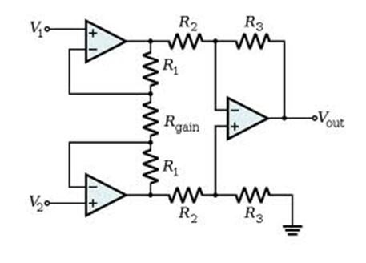
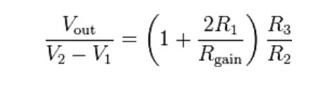

### Theory

Amplifiers are an important part of modern instrumentation systems for measuring biopotentials. Such measurements involve voltages that often are at low levels, have high source impedances, or both. Amplifiers are required to increase signal strength while maintaining high fidelity. Amplifiers that have been designed specifically for this type of processing of biopotentials are known as biopotential amplifiers. In this chapter we examine some of the basic features of biopotential amplifiers and also look at specialized systems.

The essential function of a biopotential amplifier is to take a weak electric signal of biological origin and increase its amplitude so that it can be further processed, recorded, or displayed. Usually such amplifiers are in the form of voltage amplifiers, because they are capable of increasing the voltage level of a signal. Nonetheless, voltage amplifiers also serve to increase power levels, so they can be considered power amplifiers as well. In some cases, biopotential amplifiers are used to isolate the load from the source. In this situation, the amplifiers provide only current gain, leaving the voltage levels essentially unchanged.

Figure below show the basic Biopotential amplifier circuit diagram

The gain of the circuit is

The rightmost amplifier, along with the resistors labeled R2 and R3 is just the standard differential amplifier circuit, with gain = R3 / R2 and differential input resistance = 2·R2. The two amplifiers on the left are the buffers. With Rgain removed (open circuited), they are simple unity gain buffers; the circuit will work in that state, with gain simply equal to R3 / R2 and high input impedance because of the buffers.

The buffer gain could be increased by putting resistors between the buffer inverting inputs and ground to shunt away some of the negative feedback; however, the single resistor Rgain between the two inverting inputs is a much more elegant method: it increases the differential-mode gain of the buffer pair while leaving the common-mode gain equal to 1. This increases the common-mode rejection ratio (CMRR) of the circuit and also enables the buffers to handle much larger common-mode signals without clipping than would be the case if they were separate and had the same gain. Another benefit of the method is that it boosts the gain using a single resistor rather than a pair, thus avoiding a resistor-matching problem (although the two R1s need to be matched), and very conveniently allowing the gain of the circuit to be changed by changing the value of a single resistor. A set of switch-selectable resistors or even a potentiometer can be used for Rgain, providing easy changes to the gain of the circuit, without the complexity of having to switch matched pairs of resistors.

To be useful biologically, all biopotential amplifiers must meet certain basic requirements. They must have high input impedance, so that they provide minimal loading of the signal being measured. The characteristics of biopotential electrodes can be affected by the electric load they see, which, combined with excessive loading, can result in distortion of the signal. Loading effects are minimized by making the amplifier input impedance as high as possible, thereby reducing this distortion. Modern biopotential amplifiers have input impedances of at least 10 megaohm.

The input circuit of a biopotential amplifier must also provide protection to the organism being studied. Any current or potential appearing across the amplifier input terminals that is produced by the amplifier is capable of affecting the biological potential being measured. In clinical systems, electric currents from the input terminals of a biopotential amplifier can result microshocks or macroshocks in the patient being studied-a situation that can have grave consequences. To avoid these problems, the amplifier should have isolation and protection circuitry, so that the current through the electrode circuit can be kept at safe levels and any artifact generated by such current can be minimized.

The output circuit of a biopotential amplifier does not present so many critical problems as the input circuit. Its principal function is to drive the amplifier load, usually an indicating or recording device, in such a way as to maintain maximal fidelity and range in this readout. Therefore, the output impedance of the amplifier must be low with respect to the load impedance, and the amplifier must be capable of supplying the power required by the load.

Biopotential amplifiers must operate in that portion of the frequency spectrum in which the biopotentials that they amplify exist. Because of the low level of such signals, it is important to limit the bandwidth of the amplifier so that it is just great enough to process the signal adequately. In this way, we can obtain optimal signal-to-noise ratios (SNRs). Biopotential signals usually have amplitudes of the order of a few millivolts or less. Such signals must be amplified to levels compatible with recording and display devices. This means that most biopotential amplifiers must have high gains-of the order of 1000 or greater.